# CLI-Manager

> **语言**：简体中文 | [English](README.md)

<div align="center">

**🚀 跨平台 AI CLI 增强工作台**

[](https://tauri.app/)
[](https://react.dev/)
[](https://www.rust-lang.org/)
[](https://typescriptlang.org/)
[](https://github.com/dark-hxx/CLI-Manager)
[](LICENSE)

覆盖本地终端、SSH 主机与手机协作的多项目 AI CLI 工作台

[功能特性](#-核心特性) • [竞品对比](#-产品定位与竞品对比) • [界面预览](#-界面预览) • [快速开始](#-快速开始) • [技术栈](#-技术栈) • [交流讨论](#-交流讨论)

</div>

---

## 💡 项目简介

CLI-Manager 是一款专注于 **AI CLI 工作流增强**的桌面应用，将本地与 SSH 终端、多项目管理、Claude Code / Codex 深度集成、多来源历史、Git Worktree 隔离和手机协作连接到同一工作台。

> **平台支持**：Windows（完整测试） | macOS / Linux（实验性支持，欢迎反馈）

### 🎯 为什么选择 CLI-Manager？

在多项目并行开发中，你可能遇到这些痛点：

- ❌ Claude / Codex 跑任务时得盯着终端，错过权限请求就卡住
- ❌ 想回看某次会话改了什么代码，Claude 历史没有 Diff 视图
- ❌ 不知道这个月用了多少 Token、哪个项目最费钱
- ❌ 多个项目频繁切换终端，重复输入相同命令
- ❌ 想给不同项目用不同的 Claude 后端（官方 / 中转），每次手动改环境变量

**CLI-Manager 提供：**

✅ **实时 Hook 通知** — Claude 需要审批时桌面弹窗提醒，点击直接跳转<br>
✅ **会话实时统计** — 每个终端显示当前会话 Token 用量、费用、工具调用<br>
✅ **历史 Diff 回看** — 统一查看所有历史会话的代码变更，支持跳回触发消息<br>
✅ **用量分析看板** — 多维度统计（热力图、趋势图、效率散点）<br>
✅ **SSH 远程开发** — 不离开工作区即可启动和管理远端 AI CLI 终端<br>
✅ **cc-connect 手机对话** — 通过 Telegram 或飞书继续 Claude Code / Codex 会话<br>
✅ **多来源会话历史** — 统一解析、筛选和搜索 11 类 AI CLI / Coding Agent 历史<br>
✅ **成熟 Worktree 隔离** — 通过向导完成并行任务隔离、提交、合并与清理<br>
✅ **持久后台任务** — 终端任务持续运行，重新打开应用后可直接恢复连接<br>
✅ **桌面宠物** — 用悬浮伙伴展示会话状态，并快速跳回正在执行的任务<br>
✅ **项目级供应商切换** — 一键切换 Claude 后端（官方 / 中转 / 自建），无需手动改配置<br>
✅ **灵活分屏布局** — 自由的终端分屏 + Tab 跨 pane 拖拽<br>
✅ **命令面板 & 模板** — `Ctrl+P` 快速启动项目 / 执行常用命令

---

## ✨ 核心特性

### 🔥 Claude Code / Codex CLI 深度集成

<table>
<tr>
<td width="50%">

#### 🔔 Hook 实时通知

- **权限审批提醒** — Claude 需要审批时桌面弹窗，点击跳转
- **任务状态同步** — 终端 Tab 实时显示运行中 / 待审批 / 完成 / 失败状态
- **OSC 133 Shell 集成** — 标准化命令边界检测
- **SessionStart 会话绑定** — 自动关联终端与 Claude 会话 ID

</td>
<td width="50%">

#### 📊 会话实时统计

- **Token 用量实时监控** — 当前会话 input / output / cache Token 构成
- **费用估算** — 实时计算当前会话成本
- **工具调用明细** — 查看 Claude 调用了哪些工具 / MCP 扩展
- **Git 分支显示** — 自动识别当前项目 Git 分支

</td>
</tr>
</table>

<table>
<tr>
<td width="50%" align="center">

<br><sub>Hook 通知弹窗 + Tab 状态实时同步</sub>
</td>
<td width="50%" align="center">
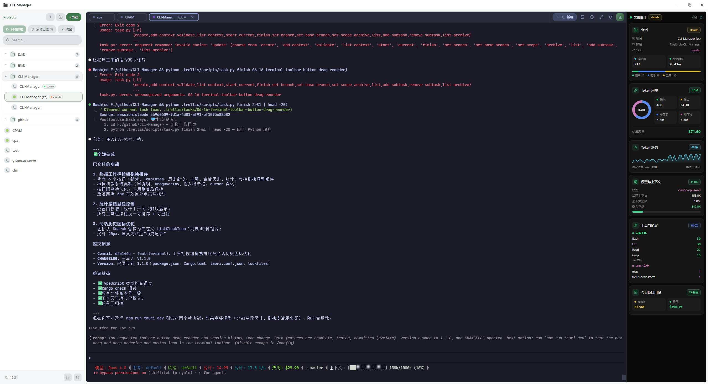
<br><sub>终端实时统计：Token / 费用 / Git 分支</sub>
</td>
</tr>
</table>


---

### 📜 历史会话统一管理

<table>
<tr>
<td width="50%">

#### 🗂️ 会话浏览

- **多来源统一视图** — 集中查看 Claude Code、Codex、Gemini、Copilot CLI、Antigravity、Grok Build、Pi、OpenCode、Kiro、Cursor 和 Cline 历史
- **智能筛选** — 按来源 / 项目 / 时间分组
- **会话内搜索** — 搜索高亮 + 跳转定位
- **标签 & 收藏** — 为重要会话打标签

</td>
<td width="50%">

#### 🔍 Diff 回看

- **Claude / Codex 深度能力** — Diff 回看、消息编辑、恢复会话与跨格式互转
- **代码变更可视化** — Unified Diff / Codex Patch 风格
- **行级高亮** — 新增 / 删除 / hunk header 分色显示
- **跳回触发消息** — 从 Diff 块快速定位到对应的对话
- **Prompt Library** — 提取历史 Prompt 快速复用

</td>
</tr>
</table>

<p align="center">
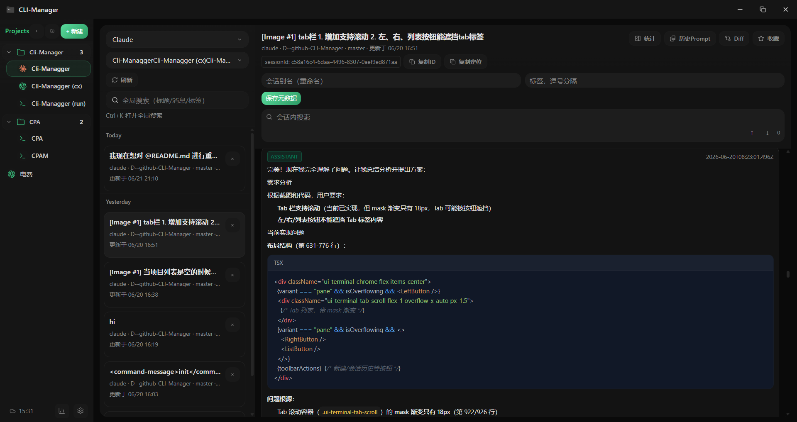
<br><sub>历史会话列表 + 会话内搜索与 Diff 回看</sub>
</p>

#### 会话来源能力矩阵

`✅` 完整支持 · `👁️` 只读支持 · `—` 暂不支持 · `DB` 数据库存储来源，没有独立原始会话文件

| 来源 | 浏览 | 搜索 | 统计 | 原始数据 | Diff / 变更 | 恢复会话 | 编辑 / 删除 | 会话互转 | 实时统计 |
|---|:---:|:---:|:---:|:---:|:---:|:---:|:---:|:---:|:---:|
| Claude Code | ✅ | ✅ | ✅ | ✅ | ✅ | ✅ | ✅ | ✅ | ✅ |
| Codex CLI | ✅ | ✅ | ✅ | ✅ | ✅ | ✅ | ✅ | ✅ | ✅ |
| Gemini CLI | 👁️ | 👁️ | 👁️ | 👁️ | — | — | — | — | — |
| GitHub Copilot CLI | 👁️ | 👁️ | 👁️ | 👁️ | — | — | — | — | — |
| Antigravity | 👁️ | 👁️ | 👁️ | 👁️ | — | — | — | — | — |
| Grok Build | 👁️ | 👁️ | 👁️ | 👁️ | — | — | — | — | — |
| Pi | 👁️ | 👁️ | 👁️ | 👁️ | — | — | — | — | — |
| OpenCode | 👁️ | 👁️ | 👁️ | DB | — | — | — | — | — |
| Kiro | 👁️ | 👁️ | 👁️ | 👁️ | — | — | — | — | — |
| Cursor | 👁️ | 👁️ | 👁️ | 👁️ | — | — | — | — | — |
| Cline | 👁️ | 👁️ | 👁️ | 👁️ | — | — | — | — | — |

> 统计能力取决于各来源实际记录的字段。Claude Code 与 Codex CLI 集成最深，额外支持 Hook 实时状态、文件变更 Diff、带审计与撤回的消息编辑、恢复会话以及双向会话互转。

---

### 📈 多维度用量分析

#### 多维度数据洞察

- **Token 构成分析** — input / output / cache creation / cache read 分项统计
- **费用估算** — 支持 Claude、GPT、o 系列模型自动定价
- **项目排行榜** — 点击项目名即可按项目过滤（可交互）
- **活跃热力图** — 7 / 30 / 90 天范围，点击日期下钻查看当日会话
- **Token 趋势图** — 会话 / 消息 / Token 趋势，支持 hover 详情
- **效率散点图** — 项目效率分析（Token 使用 vs 会话数）
- **24 小时活跃分布** — 了解自己的高效时段

<table>
<tr>
<td width="50%" align="center">
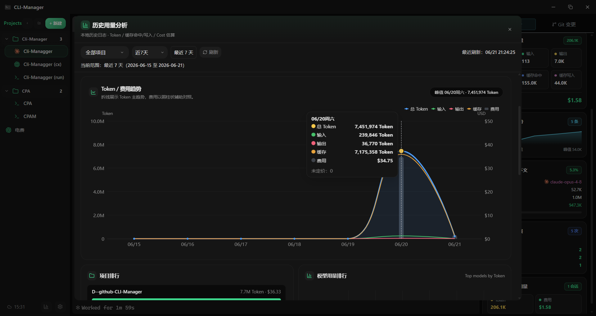
<br><sub>多维度统计看板：热力图 / Token 趋势 / 效率散点 / 项目排行</sub>
</td>
<td width="50%" align="center">
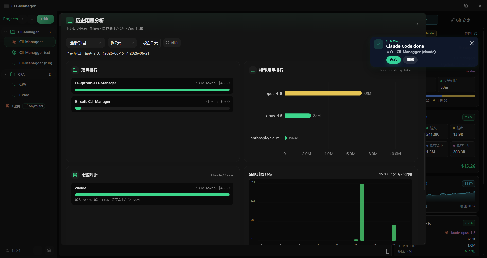
<br><sub>Token 构成饼图 / 模型占比 / 活跃时段分布</sub>
</td>
</tr>
</table>

---

### 🔄 cc-switch 供应商集成

#### 项目级后端一键切换

- **供应商管理** — 只读解析 cc-switch 数据库，按 app_type 分类展示
- **项目级切换** — 右键项目 → 切换供应商 → 自动写入 `.claude/settings.json`
- **跟随全局 / 项目覆盖** — 灵活选择全局默认或项目级覆盖
- **供应商徽标** — 项目树为覆盖供应商的项目显示独立徽标

**使用场景：**
- 官方接口调试项目 A
- 中转接口开发项目 B
- 自建后端测试项目 C
- 无需手动修改环境变量，一键切换

<table>
<tr>
<td width="50%" align="center">
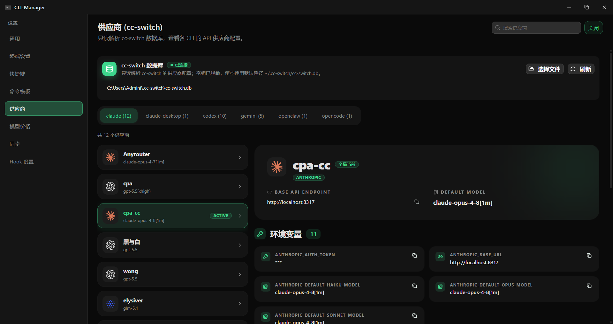
<br><sub>供应商列表与详情</sub>
</td>
<td width="50%" align="center">
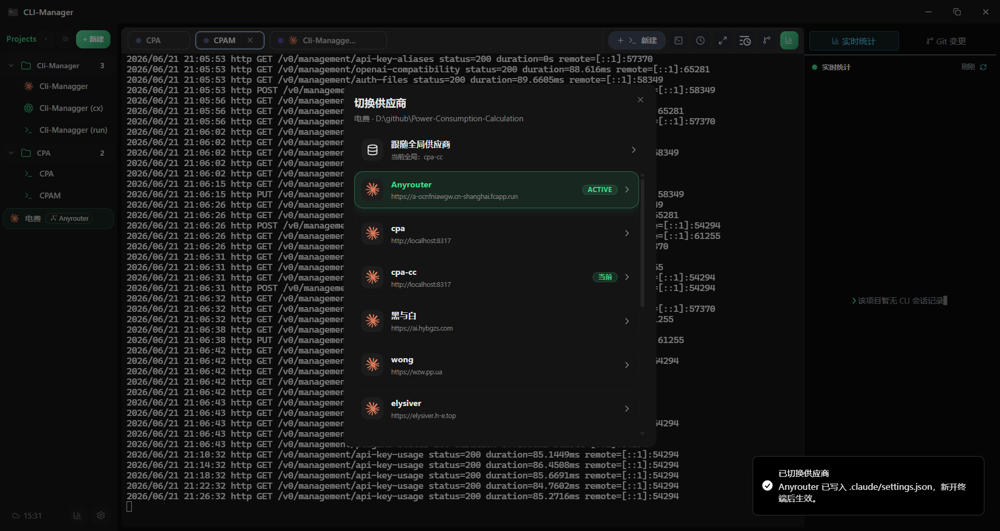
<br><sub>项目右键菜单：一键切换供应商</sub>
</td>
</tr>
</table>

---

### 🌐 SSH 远程开发

- **SSH 主机管理** — 支持 SSH Config、Agent、私钥、密码 / Keyboard-interactive、跳板机和 ProxyCommand
- **代理与诊断** — 内置 HTTP CONNECT / SOCKS5 代理助手、连接测试、主机密钥确认和完整诊断日志
- **远程项目工作流** — 浏览远端目录，配置远端启动命令与环境变量，在目标路径直接启动 AI CLI
- **工作区集成** — 远程终端支持 Tab、分屏、Workspan、后台执行和 daemon 恢复
- **凭据安全** — 密码保存到操作系统凭据管理器；同步与导出不会携带密码、凭据或私钥路径

> SSH MVP 中，文件浏览、Git / Worktree、本地历史、Hook 统计和供应商切换等仅适用于本地项目的能力会明确禁用。

<p align="center">
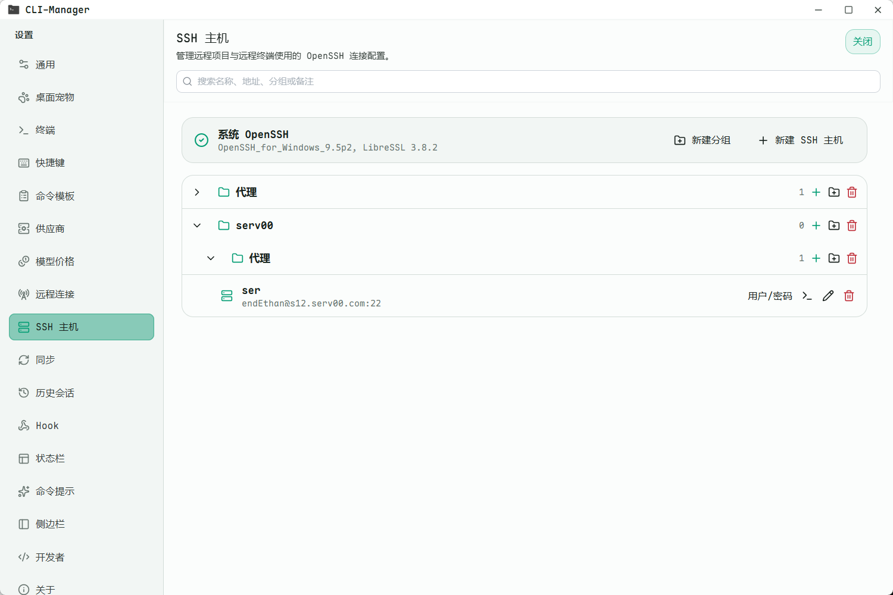
<br><sub>SSH 主机管理、认证、代理与连接诊断</sub>
</p>

---

### 📱 cc-connect 手机对话

- **手机发起对话** — 通过 Telegram 或飞书，在桌面主机上发起独立的 Claude Code / Codex 会话
- **项目级授权** — 明确选择允许远程访问的项目，并通过默认拒绝的用户 ID 白名单限制访问者
- **托管运行** — CLI-Manager 校验受支持 cc-connect 程序的版本与 SHA-256，生成隔离配置、托管进程，并可随应用自动启动
- **凭据安全** — Bot Token、App ID 和 App Secret 保存到 Windows 凭据管理器，不写入生成的配置文件
- **Claude 与 Codex 支持** — Claude 使用自身权限模式；Codex 使用 app-server stdio 审批通道，YOLO 模式必须经过明确风险提示和二次确认
- **历史汇合** — 手机端产生原生 CLI 历史，后续会自动进入 CLI-Manager 的统一会话工作区

> 当前 cc-connect 集成运行在 Windows 桌面主机上，首版每次托管一个项目和一个消息平台，支持 Telegram 与飞书。

<table>
<tr>
<td width="50%" align="center">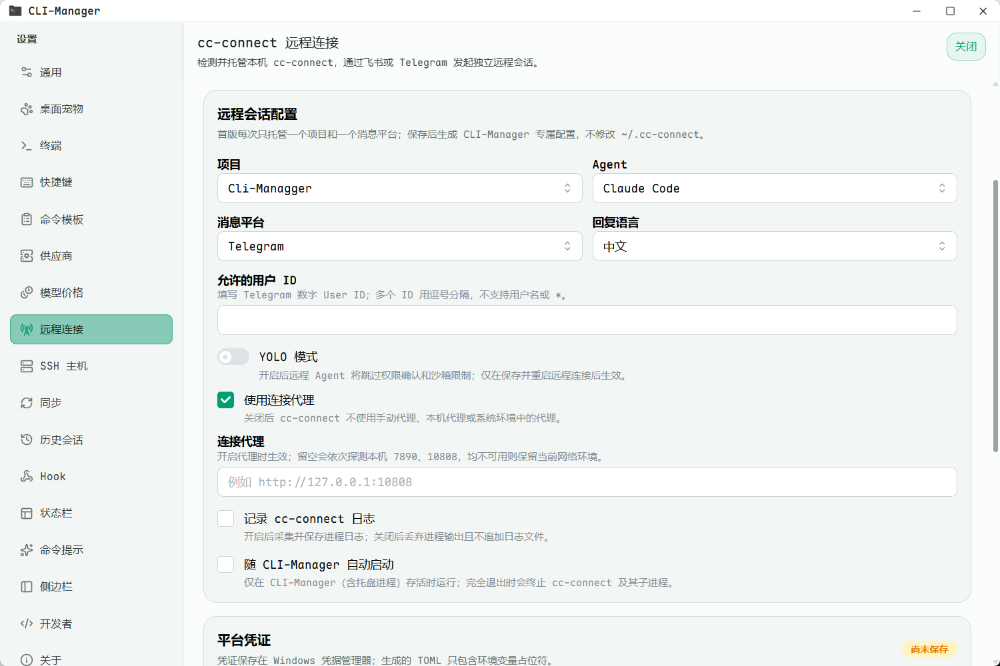<br><sub>项目 / Agent 选择、白名单、凭据与进程状态</sub></td>
<td width="50%" align="center">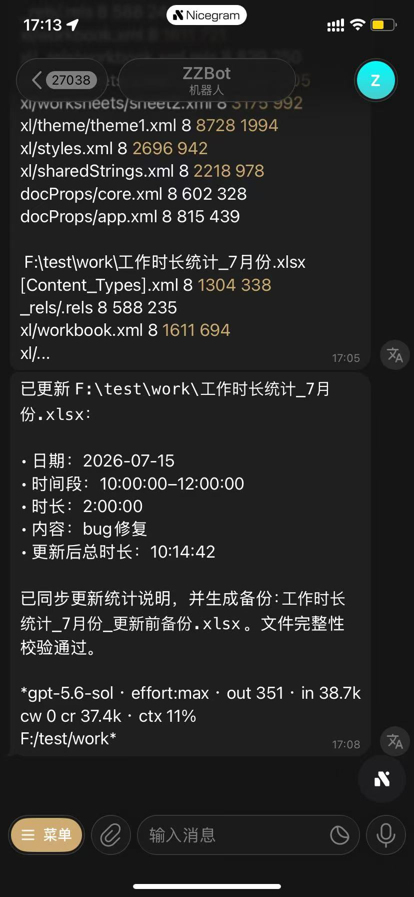<br><sub>通过 Telegram 或飞书与 Claude Code / Codex 对话</sub></td>
</tr>
</table>

---

### 💻 终端与分屏

<table>
<tr>
<td width="50%">

#### 🖥️ 内置终端

- **多 Shell 支持** — Windows（PowerShell / CMD / Pwsh / WSL / Git Bash）、macOS / Linux（Bash / Zsh 等）
- **Tab 管理** — 拖拽排序 / 溢出滚动 / 复制配置
- **性能优化** — 高频输出合并 / WebGL 渲染 / 非激活降频
- **中文输入法完美支持** — 候选框锚点冻结 / 流式重绘免疫
- **终端搜索** — `Ctrl+F` 搜索历史输出
- **自定义背景** — 支持图片 / 透明度 / 高斯模糊 / 暗化覆盖

</td>
<td width="50%">

#### 📐 灵活分屏

- **自由布局** — Split Right / Split Down / 混合嵌套
- **拖拽分隔线** — 调整相邻 pane 比例
- **Tab 跨 pane 拖拽** — Tab 拖到其它 pane 或边缘创建分屏
- **独立 Tab 栏** — 每个 pane 拥有独立 Tab 栏

</td>
</tr>
</table>

<p align="center">
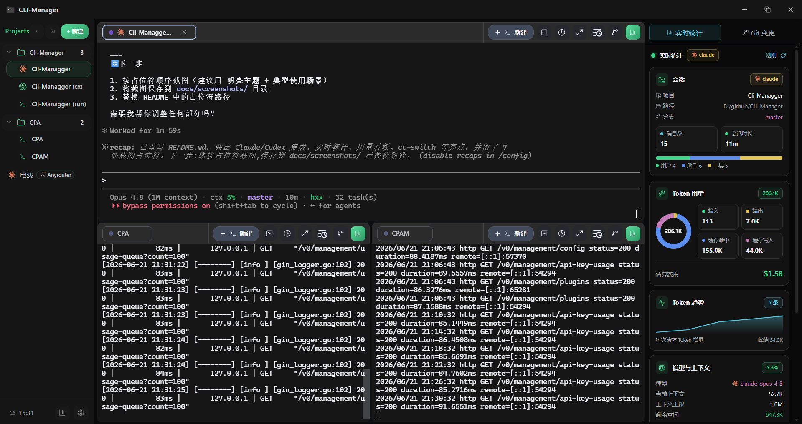
<br><sub>灵活分屏布局 + Tab 跨 pane 拖拽</sub>
</p>

#### 持久工作区与后台任务

- **Workspan 工作区** — 将多个终端与嵌套分屏组织成可持久化的顶层工作区
- **daemon 会话托管** — 主窗口退出后 CLI 任务仍可继续运行，重新打开时直接 attach，不会重复执行启动命令
- **有序回放与恢复** — 重连后按顺序恢复终端输出、Tab 元数据、分屏布局与实时输出
- **后台任务中心** — 查看、恢复、丢弃或清理由主窗口外持续运行的任务

---

### ⚡ 命令复用与快捷操作

#### 🎯 命令面板

- **`Ctrl+P` 全局面板** — 模糊搜索 / 键盘导航
- **快速启动项目** — 从命令面板直接启动项目终端
- **执行命令模板** — 一键执行常用命令

#### 📝 命令模板

- **三级作用域** — 全局 / 项目 / 会话级模板
- **变量替换** — `${projectPath}` / `${projectName}`
- **命令提示** — 结合模板、已有本地历史、内置 AI CLI 命令和路径补全生成候选，补全后不会自动执行

<table>
<tr>
<td width="50%" align="center">
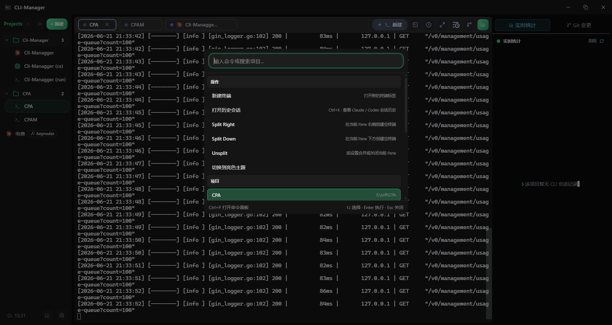
<br><sub>命令面板：模糊搜索 + 快速启动</sub>
</td>
<td width="50%" align="center">
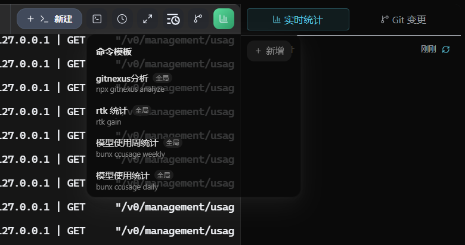
<br><sub>命令模板：三级作用域 + 变量替换</sub>
</td>
</tr>
</table>

---

### 🗂️ 项目管理

- **项目分组** — 支持多层级分组 / 拖拽排序 / 折叠展开
- **项目配置** — 独立配置路径 / Shell / 启动命令 / 环境变量
- **健康检查** — 自动检测失效路径
- **右键菜单** — 打开所在目录 / 切换供应商 / 启动终端
- **Git 集成** — 自动识别项目 Git 分支
- **内置文件与 Git 工具** — 文件浏览 / 编辑、Git 状态与 Diff、Hunk 回滚和子仓库展示
- **成熟的 Worktree 隔离** — 支持提醒、并行任务自动隔离或始终隔离到独立目录与 `wt/<任务名>` 分支
- **完成任务闭环** — 审查并提交改动、合并回主工作区，冲突时安全中止，最后清理 Worktree 与分支

---

### ☁️ WebDAV 云同步

- **版本化备份** — 使用不可变历史快照，不再只覆盖同一份备份
- **按域恢复** — 可选择恢复不同数据域，恢复前自动创建安全快照，并支持撤回最近一次恢复
- **多设备保留** — 按设备保存独立快照并自动保留最近版本
- **离线重试** — 上传失败会进入 outbox，在后续启动时自动重试
- **本地导入导出** — ZIP 备份复用同一套安全恢复流程

---

### 🎨 个性化与主题

- **应用主题** — 多种内置主题与自定义能力
- **终端主题** — Tokyo Night / Dracula / Monokai / Nord / Solarized 等
- **字体自定义** — UI 字体 / 终端字体 / 字号 / 字体颜色
- **快捷键配置** — 所有快捷键可自定义
- **精简模式** — 紧凑界面 + 外部终端默认启动
- **桌面宠物** — 悬浮状态伙伴、任务列表与会话跳转、尺寸 / 位置 / 置顶设置、`.clipet` 宠物包及 Codex Pets 兼容

<p align="center">
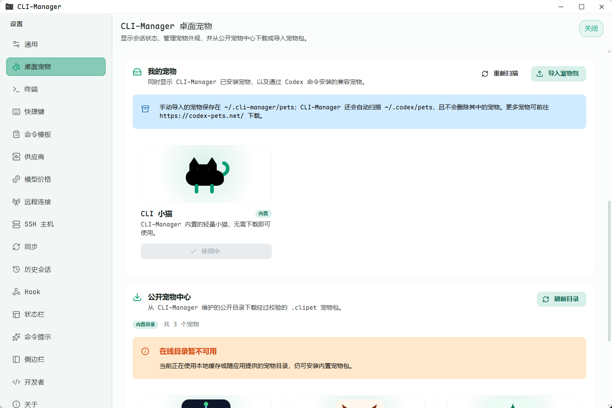
<br><sub>桌面宠物、任务列表、宠物图鉴与 `.clipet` 宠物包管理</sub>
</p>

---

## 🧭 产品定位与竞品对比

CLI-Manager 的定位是一个**可长期使用的 AI CLI 工作台**：把本地与 SSH 终端、多 Agent 执行、长期会话历史、Git Worktree 隔离、用量分析、供应商配置、后台任务和手机对话连接成一个完整产品。

以下对比基于 [Orca](https://github.com/stablyai/orca) 与 [cmux](https://github.com/manaflow-ai/cmux) 在 2026-07-05 的公开项目定位；CLI-Manager 尚未交付的能力会明确标记为“规划中”。

| 对比点 | CLI-Manager | Orca | cmux |
|---|---|---|---|
| 核心定位 | 跨项目、本地 / SSH 终端、历史、统计和配置的一体化长期 AI CLI 工作台 | 在隔离 Worktree 中进行多 Agent 编排、结果比较与合并 | 面向 Agent pane、通知和可编程界面的原生 macOS 终端工作区 |
| 桌面平台 | Windows 完整测试；macOS / Linux 实验支持 | macOS / Windows / Linux | macOS |
| 远程工作流 | 内置 SSH 远程项目 / 终端，并可通过 cc-connect 在 Telegram / 飞书手机端对话 | SSH Worktree 与远程编排工作流 | 通过 SSH / tmux 组合远程终端工作流 |
| 会话历史 | 解析 11 类来源，统一浏览、搜索、筛选、标签、收藏和统计 | 侧重账号、用量、通知与 AI Diff 等能力 | 会话恢复、通知面板与工作区元数据 |
| 深度历史操作 | Claude / Codex Diff、文件变更、消息编辑 / 删除、审计撤回、恢复会话和双向互转 | 公开定位中不是核心方向 | 公开定位中不是核心方向 |
| Git Worktree 生命周期 | 成熟的项目级隔离：提醒 / 自动策略、独立分支、依赖初始化、历史、提交、合并、冲突中止和清理 | 多 Agent 并行编排的核心模型 | 更偏外部组合式 Git 工作流，不提供任务完成向导闭环 |
| Agent 可视化 | 子 Agent 自动分屏、会话关联与实时状态 | 多 Agent 隔离执行、结果对比与合并 | 原生 pane / split 展示 Agent 与相关工具 |
| 统计与配置 | Token / 费用 / 模型 / 项目分析、cc-switch 供应商集成、WebDAV 版本化备份 | 用量、rate-limit 跟踪与账号切换 | Ghostty 配置、CLI / socket API、Hook 与 OSC 集成 |
| 手机与 Web | cc-connect 手机对话已可用；独立 Web 端和 Mobile 端正在规划 | 公开产品定位包含移动端伴侣 | 以 macOS 桌面端为主 |
| 个性化 | 应用 / 终端主题、自定义背景、状态栏工具和桌面宠物 | 产品自身的编排视图与界面 | 原生终端主题与 Ghostty 配置兼容 |

**选择建议：**

- 选择 **CLI-Manager**：如果你需要围绕 Claude Code、Codex 和其他 AI CLI 历史构建长期工作台，尤其重视 SSH、Worktree 隔离、深度历史操作、用量分析、供应商管理与手机访问。
- 选择 **Orca**：如果核心工作流是把同一任务分发给多个隔离 Agent，比较结果并合并最佳产出。
- 选择 **cmux**：如果优先考虑 macOS 原生高性能终端、可编程 pane、通知以及终端 / 浏览器组合界面。

### 🌍 多端产品路线

| 载体 | 状态 | 定位 |
|---|---|---|
| 桌面应用 | ✅ 已可用 | 完整的终端、项目、历史、Git、统计、SSH 与后台任务工作区 |
| 手机对话 | ✅ 已通过 cc-connect 可用 | 在 Telegram / 飞书与 Claude Code / Codex 对话，由桌面主机托管会话 |
| Web 端 | 🧭 规划中 | 通过浏览器访问 CLI-Manager 工作流，具体范围与交付时间尚未承诺 |
| 独立 Mobile 端 | 🧭 规划中 | 超越消息平台对话的第一方移动伴侣，具体范围与交付时间尚未承诺 |

---

## 🤖 Agent 并行能力

CLI-Manager 提供两条成熟的并行工作路径：在终端工作区内自动可视化子 Agent，以及使用项目级 Git Worktree 隔离独立任务。

### 🤖 子 Agent 自动分屏

- **智能分屏** — Claude Code 派发子 Agent 时自动创建分屏终端
- **会话关联** — 每个子 Agent 独立终端，状态实时同步
- **布局优化** — 根据 Agent 数量自动调整分屏布局

### 🌿 成熟的 Git Worktree 并行任务隔离

- **灵活隔离策略** — 默认保持普通打开，也可在存在并行 CLI 任务时提醒、自动隔离并行会话或始终创建 Worktree
- **独立目录与分支** — 每个任务使用独立 Worktree 目录和 `wt/<任务名>` 分支
- **完整项目上下文** — 文件浏览、Git 状态、会话历史、实时统计、供应商覆盖和终端聚焦都会跟随当前 Worktree
- **依赖初始化** — 可选检测缺失依赖，并新建专用安装终端
- **完成任务向导** — 审查并提交改动、合并回主工作区、冲突时安全中止，最后清理 Worktree / 分支
- **安全保护** — 主工作区脏时阻止合并、无差异时跳过无意义合并，并处理 stale / 损坏 Worktree 与 Windows 文件锁清理重试

---

## 📸 界面预览

<p align="center">
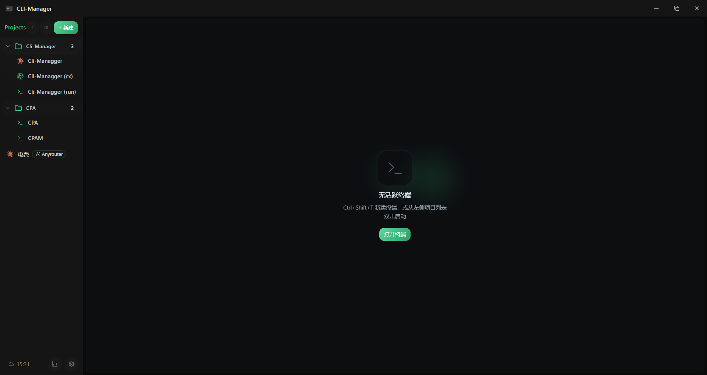
<br><sub>主界面 — 终端工作区</sub>
</p>

---

## 🛠️ 技术栈

### 前端

- **框架**：React 19 + TypeScript 5.8
- **构建工具**：Vite 7
- **状态管理**：Zustand
- **样式**：Tailwind CSS 4
- **终端**：xterm.js + FitAddon + WebglAddon
- **UI 组件**：Radix UI, Mantine Core
- **图表**：ECharts
- **拖拽**：@dnd-kit
- **Diff 展示**：react-diff-view

### 后端

- **运行时**：Tauri 2.x
- **语言**：Rust
- **数据库**：SQLite (tauri-plugin-sql)
- **存储**：tauri-plugin-store
- **PTY**：Rust PTY 会话管理
- **云同步**：WebDAV 适配层

### 核心能力

- 跨平台桌面应用（Windows / macOS / Linux，基于 Tauri 2）
- 多 Shell 支持（Windows：PowerShell / CMD / Pwsh / WSL / Git Bash；macOS / Linux：Bash / Zsh 等）
- PTY 会话管理与状态广播
- daemon 后台任务托管、有序回放、attach 与工作区恢复
- Claude Code / Codex Hook Bridge（127.0.0.1 回环 + bearer token 校验）
- 子 Agent 自动分屏（类 cmux，Claude Code 派发子 Agent 时自动创建分屏终端）
- 成熟的 Git Worktree 任务隔离与提交 / 合并 / 清理闭环
- 多来源历史解析（Claude Code、Codex CLI、Gemini CLI、GitHub Copilot CLI、Antigravity、Grok Build、Pi、OpenCode、Kiro、Cursor、Cline）
- Claude / Codex 深度历史能力（Diff、编辑、恢复、互转与统计）
- SSH 远程项目与远程终端（OpenSSH Launch Plan、代理、诊断与远程目录浏览）
- cc-connect 手机对话（通过 Telegram / 飞书连接 Claude Code 或 Codex）
- 桌面宠物（`.clipet` 宠物包与 Codex Pets 兼容）
- cc-switch 供应商数据库只读解析
- WebDAV 云同步与冲突处理
- Git 集成（分支识别 / 项目路径健康检查）

---

## 🚀 快速开始

### 方式一：下载可执行版本

前往 [Releases](https://github.com/dark-hxx/CLI-Manager/releases) 页面获取最新版本。

> 目前主要提供 Windows 构建产物；macOS / Linux 用户建议从源码构建（见下方）。

### 方式二：从源码运行

#### 前置要求

- Node.js >= 20
- Rust >= 1.70
- 操作系统：Windows 10/11 | macOS | Linux

#### 安装依赖

```bash
npm install
```

#### 开发运行

```bash
npm run tauri dev
```

#### 构建发行版本

```bash
npm run tauri build
```

#### 其他常用命令

```bash
# TypeScript 类型检查
npx tsc --noEmit

# Rust 检查
cd src-tauri && cargo check

# Rust 测试
cd src-tauri && cargo test
```

---

## 🎯 适用场景

- ✅ 高频使用 Claude Code / Codex CLI 的开发者
- ✅ 需要实时监控 Token 用量与费用的用户
- ✅ 想回看历史会话代码变更的用户
- ✅ 希望统一搜索多个 AI CLI 工具历史记录的用户
- ✅ 需要通过 SSH 在远端主机运行 AI CLI 任务的开发者
- ✅ 希望在手机端继续 Claude Code / Codex 对话的开发者
- ✅ 并行任务需要成熟 Git Worktree 隔离与合并清理闭环的团队
- ✅ 希望长时间 CLI 任务在窗口关闭或应用重启后继续运行的用户
- ✅ 希望用轻量桌宠直观看到任务与会话状态的用户
- ✅ 多项目并行开发，需要频繁切换终端的场景
- ✅ 使用 cc-switch 管理多个 Claude 后端的用户
- ✅ 需要跨设备同步开发配置的用户

---

## 📋 功能速查

<details>
<summary><b>项目管理</b></summary>

- 项目分组 / 搜索 / 拖拽排序
- 项目配置（路径 / Shell / 启动命令 / 环境变量）
- 路径健康检查
- Git 分支自动识别
- 右键菜单（打开目录 / 切换供应商）
- 内置文件浏览 / 编辑与 Git Diff 工具
- Git Worktree 隔离策略与完成任务向导

</details>

<details>
<summary><b>终端工作区</b></summary>

- 内置 PTY 终端（xterm.js）
- Tab 管理（拖拽排序 / 溢出滚动 / 复制配置）
- 灵活分屏（Split Right / Split Down / 混合嵌套）
- Tab 跨 pane 拖拽
- 可持久化的 Workspan 工作区
- daemon 后台任务与会话恢复
- 终端搜索（`Ctrl+F`）
- 自定义背景（图片 / 透明度 / 高斯模糊）
- 中文输入法完美支持

</details>

<details>
<summary><b>AI CLI 集成与会话历史</b></summary>

- Hook 实时通知（权限审批 / 任务完成 / 失败）
- Tab 状态点（运行中 / 待审批 / 完成 / 失败）
- 会话实时统计（Token / 费用 / 工具调用 / Git 分支）
- 多来源历史解析（支持 11 类来源）
- 统一筛选 / 搜索 / 标签 / 收藏
- Diff 回看（Unified Diff / Codex Patch）
- Claude / Codex 消息编辑、会话恢复与互转
- Prompt Library

</details>

<details>
<summary><b>SSH 远程开发</b></summary>

- SSH 主机分组与主机管理
- SSH Config / Agent / 私钥 / 密码认证
- 跳板机 / ProxyCommand / HTTP CONNECT / SOCKS5
- 连接诊断与主机密钥确认
- 远程目录浏览与启动命令
- 远程 Tab / 分屏 / Workspan / 后台恢复

</details>

<details>
<summary><b>cc-connect 手机对话</b></summary>

- Telegram / 飞书手机对话
- Claude Code / Codex Agent 选择
- 项目级授权与用户 ID 白名单
- cc-connect 程序校验与托管运行
- Windows 凭据管理器保存平台凭证
- 原生历史自动汇入 CLI-Manager

</details>

<details>
<summary><b>用量分析</b></summary>

- 多维度统计看板
- Token 构成分析（input / output / cache）
- 费用估算
- 项目排行榜（可交互）
- 活跃热力图（7 / 30 / 90 天）
- Token 趋势图
- 效率散点图
- 24 小时活跃分布

</details>

<details>
<summary><b>cc-switch 集成</b></summary>

- 只读解析供应商数据库
- 按 app_type 分类展示
- 项目级供应商一键切换
- 自动写入 `.claude/settings.json`
- 跟随全局 / 项目覆盖

</details>

<details>
<summary><b>命令复用</b></summary>

- 命令面板（`Ctrl+P`）
- 命令模板（全局 / 项目 / 会话级）
- 行内命令提示（模板 / 已有本地历史 / AI CLI 命令 / 路径）
- 变量替换（`${projectPath}` / `${projectName}`）

</details>

<details>
<summary><b>云同步</b></summary>

- WebDAV 版本化快照
- 按数据域选择恢复
- 恢复前安全快照与一步撤回
- 按设备保留版本与离线 outbox 重试
- 本地导入导出（ZIP）

</details>

<details>
<summary><b>个性化</b></summary>

- 应用主题 / 终端主题
- 字体自定义（UI / 终端 / 字号 / 颜色）
- 快捷键配置
- 精简模式
- 桌面宠物 / `.clipet` 宠物包 / Codex Pets
- 终端背景自定义

</details>

---

## 🔑 默认快捷键

| 快捷键 | 功能 |
|---|---|
| `Ctrl+P` | 打开命令面板 |
| `Ctrl+K` | 打开会话历史 |
| `Ctrl+Shift+T` | 新建终端 |
| `Ctrl+W` | 关闭当前终端 |
| `Alt+ArrowRight` | 下一个 Tab |
| `Alt+ArrowLeft` | 上一个 Tab |
| `F11` | 终端全屏 |
| `Ctrl+F` | 终端搜索 / 会话内搜索 |

> 💡 所有快捷键可在「设置 - 快捷键」中自定义

---

## 💬 交流讨论
<p align="center">
  
  <br>
  <sub>扫码加入微信交流群，获取最新动态与技术支持</sub>
</p>

---

## 🎉 致谢

本项目在 [LINUX DO](https://linux.do/) 社区推广，感谢 LINUX DO 社区对开源项目的支持与认可。

---

## 📄 许可证

CLI-Manager 采用双授权模式：

- **开源授权**：[AGPL-3.0-or-later](LICENSE)。公司和个人均可在遵守 AGPL 条款的前提下使用、研究、修改、分发或通过网络提供本项目。
- **商业授权**：如果需要闭源集成、闭源改造、用于不接受 AGPL 义务的内部产品化平台、商业分发，或以专有条款提供托管/服务化能力，需要单独取得商业授权。详见 [COMMERCIAL-LICENSE.md](COMMERCIAL-LICENSE.md)。

Copyright (c) 2026 Chenyme。详见 [NOTICE](NOTICE)。

正常使用未经修改的官方应用不需要商业授权；遵守 AGPL-3.0-or-later 的开源使用也不需要商业授权。

---

## ⭐ Star History

<p align="center">
  <a href="https://www.star-history.com/?repos=dark-hxx%2FCLI-Manager&type=date&legend=top-left">
    <picture>
      <source media="(prefers-color-scheme: dark)" srcset="https://api.star-history.com/chart?repos=dark-hxx/CLI-Manager&type=date&theme=dark&legend=top-left&sealed_token=yMb1FSvSFz9fR9h9JP66BSxsU5qTaxdVJhvVj9VVFTP-2EXQ-dKINdBrzJmByEJ542IYvMXVQOvabZJv8JIEMUUosdPAKlbfQIQbuP9pnRvVtSogPwHzdw" />
      <source media="(prefers-color-scheme: light)" srcset="https://api.star-history.com/chart?repos=dark-hxx/CLI-Manager&type=date&legend=top-left&sealed_token=yMb1FSvSFz9fR9h9JP66BSxsU5qTaxdVJhvVj9VVFTP-2EXQ-dKINdBrzJmByEJ542IYvMXVQOvabZJv8JIEMUUosdPAKlbfQIQbuP9pnRvVtSogPwHzdw" />
      
    </picture>
  </a>
</p>

---

<div align="center">

**⭐ 如果这个项目对你有帮助，欢迎 Star 支持！**

[提交 Issue](https://github.com/dark-hxx/CLI-Manager/issues) • [贡献代码](https://github.com/dark-hxx/CLI-Manager/pulls) • [查看文档](docs/功能清单.md)

</div>
